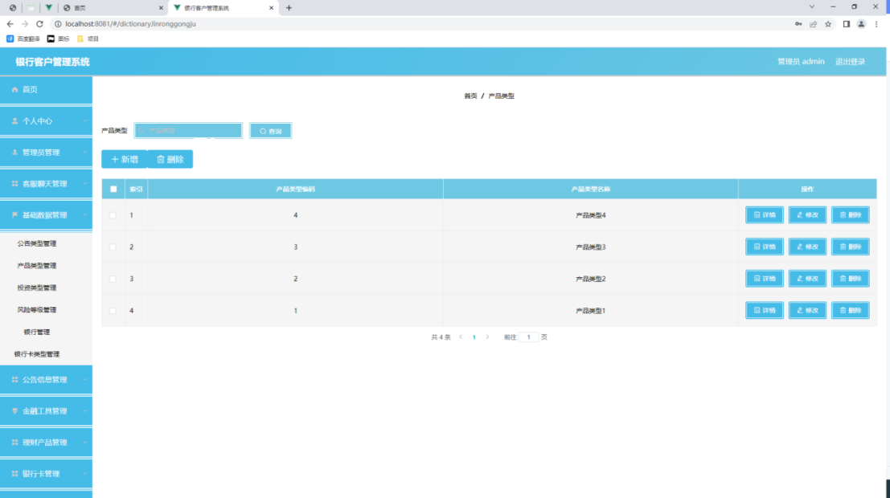

# springboot242-基于SpringBoot的银行客户管理系统

>  博主介绍：
>  Hey，我是程序员Chaers，一个专注于计算机领域的程序员
>  十年大厂程序员全栈开发‍ 日常分享项目经验 解决技术难题与技术推荐 承接各类网站设计，小程序开发，毕设等。
>  【计算机专业课程设计，毕业设计项目，Java，微信小程序，安卓APP都可以做，不仅仅是计算机专业，其它专业都可以】

## 3000套系统可挑选，获取链接：https://chaerspol.github.io/

<b>QQ【获取完整源码】：674456564</b>

<b>QQ群【获取完整源码】：1058861570</b>

### 系统架构

> 前端：html | js | css | jquery | vue
>
> 后端：springboot | mybatis
> 
> 环境：jdk1.8+ | mysql | maven

# 一、内容包括
包括有  项目源码+项目论文+数据库源码+答辩ppt+远程调试成功

# 二、运行环境

> jdk版本：1.8 及以上； ide工具：IDEA； 数据库: mysql5.7及以上；编程语言: Java

# 三、需求分析

**3.1.1 技术可行性分析**

研发设计程序流程选择面向对象设计、功能齐全、简单实用的Java编程设计核心理念。MySQL数据库存储数据。IDEA工具作为编程软件，Windows 10计算机操作系统作为应用系统，以及数据库可视化工具等技术职称。一般来说，该程序流程的开发能够从技术上开展是可行的。

**3.1.2 经济可行性分析**

开发的程序并不是向着商业程序方向设计与开发的，反而是做为一个新的毕业论文新项目开发的。它主要运用于检测小朋友们在院校所学的知识，并锻练用戶使用网络、书籍和其他方式自学能力。因而，程序软件的开发不容易涉及到边际收益，也不会为软件的选择付钱。你可以在开发软件的官网上下载所需要的软件，并依据所需要的安装方法将应用安装到你的电脑里。一般来说，开发这一程序并没有社会经济发展花费。

**3.1.3 运行可行性分析**

由于程序软件就是针对大部分一般操作用户，考虑到他的知识与文化水准，尤其开发了一个可操作度高的程序软件，能够轻而易举地让用户应用，数据可视化操作页面。一般来说，从用户操作程序的角度看，这一程序其实并不难操作。只需用户开启程序，就能避免专职人员学习培训开展程序作用操作。

**3.2系统性能分析**

需求分析报告包含根据用户实际需求制订功能和定制系统的性能需求分析报告。因而，在一般数据分析系统时，一方面要数据分析系统的作用，另一方面要知道全面的性能。终究，性能更加好的全面的设计设计和开发能够保证系统质量以及可靠性。
下面，从易学易用性、系统时间特性、系统稳定性等多个方面系统性能展开分析表明。

 (1)系统容积规定:明确系统进行数据处理方法容量更大化。换句话说，假如系统建立模型容量临界点超出这一临界点，系统可能设备异常。

（2）系统精度规定：明确传送数据所需要的精度值，包含数值计算方法的精度值、数据信息精度系数的设定等。

（3）时长特点规定：系统建立模型有时限要求，那也是系统的时间也特点。一般剖析数据处理方法的时间也，设定用户标准的响应速度，及其系统在超负荷运行中能够偏移的范围值，要提前剖析明确。

（4）适应能力规定：当系统应对系统环境变化时，其融入这些变化的能力也要根据参数信息来反映。比如，应对变动的必须，系统必须通过强调必须设计方案的一个过程或系统来适应变化来反映系统的适应能力。

（5）易学易用性：除开作用应该考虑用户要求外，人机交互设计还要考虑到用户的用户习惯，包含界面风格、页面色彩选择与色彩搭配。尝试让用户接受简单学习后单独实际操作系统。

(6)系统稳定性:针对新手来说，容易出现一个问题，那便是产品设计开发的系统，由于人工操作失误奔溃，有的还会造成电脑崩溃。这种情况也说明了容错机制能力低系统不靠谱。

# 四、功能模块

银行管理系统选用B/S架构模式，即网页页面和网站架构设计的开发方式。这类系统构造可以理解为对 C/S 系统构造的改变与推广能够进行信息分布式处理，减少资源成本，提升订制系统的性能。在这种设计下，极少有事务处理在前进行，绝大多数重要事务管理的思路需要在服务端完成。
系统的性能层为表明给用户页面，用以表明与理解用户信息，回到用户所提供的信息，交到系统解决方法，给予用户与系统之间的沟通控制面板；系统通讯层承担为性能层提供以下数据信息，并把性能层与系统环境间的通信连接下去，系统的控制层主要从事从HTTP要求中获得信息，获取主要参数，并把它发放给不一样的处理方法服务项目(Service层)，将Service层处理过的数据返回到前面(本系统应用JSON数据)；系统业务逻辑层的主要作用是识别解决用户的键入信息，完成具体业务逻辑和数据浏览；系统数据浏览层主要从事实际操作数据，为业务逻辑层或控制层给予数据服务项目；系统数据库是系统存放数据的区域，完成特殊业务需要数据适用，必须纪录信息才能达到业务流程，系统底层支撑工具采用JavaJDK、SpringMVC、MySQL等技术来进行支持。系统整体架构设计如图所示。

# 五、效果图展示【部分效果图】

图5.1 管理员登录页面【系统登录功能是程序必不可少的功能，在登录页面必填的数据有两项，一项就是账号，另一项数据就是密码，当管理员正确填写并提交这二者数据之后，管理员就可以进入系统后台功能操作区。下图就是管理员登录页面。】

图5.2  银行卡管理页面【点击进入银行卡列表，管理员可以进行查看列表、模糊搜索以及相关维护等操作。】

图5.3 公告信息管理页面【用户进入系统可以查看公告和模糊搜索公告信息、也可以进行公告维护操作，下图就是公告信息管理页面。】

图5.4 公告类型列表页面【下图就是公告类型管理页面。】

图5.5理财产品管理页面【如图5.5显示的就是理财产品管理页面，管理员可以进行查看列表、模糊搜索以及相关维护等操作。】

图5.6 产品类型管理页面【如图5.6显示的就是产品类型管理页面，此页面提供给管理员的功能有：新增产品类型,修改产品类型,删除产品类型。】

 <b>完整文章</b>
     
 
 

## 3000套系统可挑选，获取链接：https://chaerspol.github.io/

<b>QQ【获取完整源码】：674456564</b>

<b>QQ群【获取完整源码】：1058861570</b>

